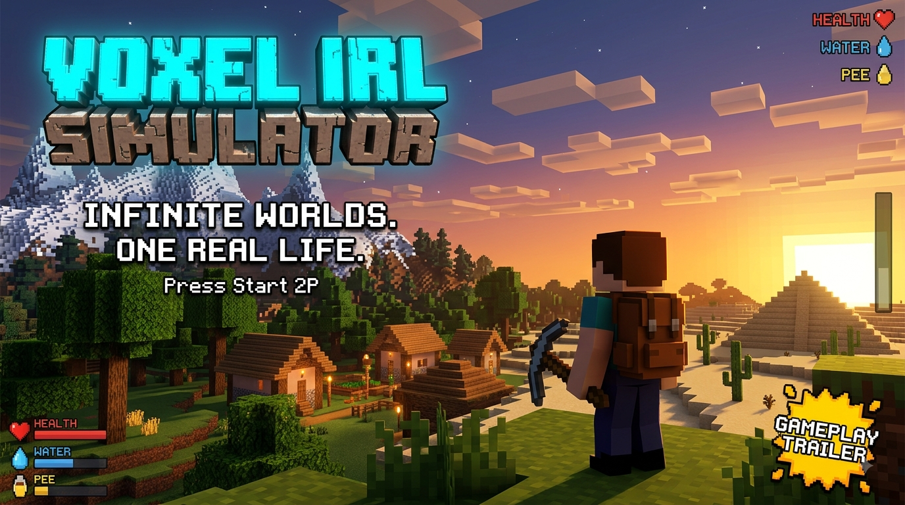

# Voxel IRL Simulator

**Official README for the Java game, browser edition, wiki, multiplayer systems, mod pipeline, and current gameplay features.**

## Overview

Voxel IRL Simulator is a custom-built voxel survival and life-simulation game. The project includes a Java engine, a playable Three.js browser edition, a large interactive wiki, procedural dimensions, survival mechanics, crafting, housing, NPCs, multiplayer features, and data-driven extension packs.

The project currently showcases:

- Custom Java voxel renderer and Three.js browser renderer
- Playable game embedded directly inside the official wiki
- Startup cinematic, startup sound, and voxel mountain sequence
- Infinite chunk-based terrain generation
- Overworld, Hell, and Space dimensions
- Surface biomes, cave biomes, Hell biomes, and generated structures
- Gravity, jumping, sprinting, flight, and full block collision
- Block selection, breaking, placement, hotbar collection, and hundreds of documented block IDs
- Day/night cycle, cubic clouds, rain, snow, thunder, and lightning
- 3x3 crafting table and 2x2 pause crafting
- Beds, sleeping, water, pee, humans, babies, followers, holograms, bosses, and housing
- Saved worlds, settings, inventory, player state, world edits, and local browser saves
- LAN hosting, hosted-world download, extraction, and remote-player synchronization hooks
- Marketplace and data-driven extension-pack pipeline
- Desktop, phone, and tablet controls
- Pixel interface, Press Start 2P typography, square retro scrollbars, and mobile topbar navigation

---

## Editions

### Java Edition

The primary engine is a custom Java implementation with software rendering, world saving, menus, LAN systems, NPCs, survival features, and extension-pack support.

### Browser Edition

The wiki contains a playable Three.js edition with:

- WebGL rendering
- Custom GLSL voxel materials
- Infinite chunk streaming
- Local saved worlds
- Desktop and touch input
- Block breaking and placement
- Crafting, chat, weather, dimensions, and survival HUD
- Mobile one-chunk optimization

The browser game remains contained inside the wiki and includes a **Close Game** button that returns to the Overview page.

---

# Startup Experience

## Startup Cinematic

On startup, voxel blocks form the title sequence and transition into a 3D mountain scene. The browser edition includes a camera sequence that moves through and out of the mountains before displaying:

> Hi, sample!

The cinematic includes a generated startup sound and can be skipped with a click or key press.

## Window Title

The Java window title can use:

```text
IRL SIMULATOR 3D - player name | random splash saying
```

Example splash sayings include:

- Now with 3D!
- Powered by Java!
- Grox Mode Enabled!
- Hydrate or Diedrate!
- Your GPU is crying.
- Welcome back, explorer!
- Reality is buffering.
- Your chunks have unionized.

## Startup Arguments

```text
--PathToClasses path
--Name playerName
--skinDir directory
--version number
```

These configure the class path, player name, skin directory, displayed version, and startup environment.

---

# Controls

## Desktop

| Input | Action |
|---|---|
| W, A, S, D | Move |
| Shift while grounded | Sprint |
| Space | Jump |
| F | Toggle flight |
| Space while flying | Fly upward |
| Shift while flying | Fly downward |
| Hold left mouse and drag | Look around |
| Right click | Place selected block or interact |
| B | Break selected block |
| P | Place selected block |
| 1-9 | Select hotbar slot |
| T | Open chat |
| Escape | Pause or close menu |
| F5 | Save |
| F6 | Toggle follower |
| F7 | Switch dimension |

The center selection outline shows the targeted voxel face. Breaking a block adds that block to the first available hotbar slot. Placing consumes the selected hotbar item and prevents placement inside the player.

## Mobile and Tablet

The mobile layout includes:

- Horizontal pixel topbar containing the complete wiki navigation
- Left movement controls: up, left, jump, and right
- Place Block and Break Block buttons
- Fly and F7 buttons
- Pause, Chat, and Craft buttons
- Touch hotbar
- Drag anywhere on the game canvas to look around
- Expandable control customization panel
- Portrait and landscape layouts
- One-chunk rendering for improved performance

Mobile settings include control size, look sensitivity, drag dead zone, handed layout, contrast, and shortened labels.

---

# Physics and Voxel Interaction

The browser edition includes:

- Gravity
- Ground detection
- Jump velocity
- Ground sprinting
- Flight ascent and descent
- Player collision box
- Collision against all voxel faces
- Center-screen ray selection
- Block breaking
- Block collection into the hotbar
- Block placement on the selected face
- Placement collision checks

The default hotbar begins empty.

---

# Main Menu and World Menus

The main menu includes:

- Play
- Multiplayer
- Marketplace
- Mod Store / Inbox
- Level Options
- Win12 Pages
- Theme and Credits
- Download Full Game

## Saved Worlds

The world menu supports saved-world selection and world creation. New worlds can store:

- Name
- Seed
- Game mode
- Difficulty
- Infinite-generation setting
- Inventory
- Player state
- Dimension
- Weather
- Time
- Block edits
- Render distance

## Options

Options include:

- Render distance
- Occlusion culling
- Chunk streaming
- Chunk meshing mode
- Shader quality
- Wiki theme
- Text size
- Reduced motion

**Apply** changes the current session. **Save & Apply** writes supported preferences to local storage and immediately applies them.

---

# World Generation

World generation uses deterministic seeded terrain and 16x16 chunk streaming.

## Chunk System

- Nearby chunks generate around the player.
- Distant chunks unload.
- Mobile uses a one-chunk view for performance.
- The debug HUD displays loaded chunks and the current biome.
- Generated terrain uses the saved world seed.

## Overworld Biomes

- Plains
- Forest
- Desert
- Ocean
- Tundra
- Jungle
- Large Snowy Mountains

## Overworld Cave Biomes

- Stone Caves
- Moss Caves
- Crystal Caves
- Ice Caves
- Fire Caves

## Hell Surface Biomes

- Ash Wastes
- Bloodrock Fields
- Firelands
- Bosslands

## Hell Cave Biomes

- Blood Caves
- Fire Caves
- Boss Caves

## Structures

- Spawn Ritual
- Villages
- Abandoned Boss Houses
- TNT Ruins
- Jungle Monkey Houses
- Boss Temples
- Underwater Guardian Temples

The wiki includes interactive voxel previews for biomes, structures, cave biomes, and Hell biomes.

---

# Dimensions

## Overworld

The Overworld contains procedural terrain, trees, mountains, caves, structures, NPCs, weather, cubic clouds, water, and the full day/night cycle.

## Hell

Hell includes a red atmosphere, a roof layer, Hellstone, Bloodrock, Ash, Fire, surface biomes, cave biomes, boss areas, and procedural decoration.

## Space

Space contains sparse space rocks, stars, and large generated planetary regions:

- Earth
- Mars
- Jupiter
- Sun
- Hell planet

Reaching the sky limit can transition the player into Space. Landing on Earth returns the player to the Overworld. The Hell planet can transition the player into Hell.

---

# Day, Night, Clouds, and Weather

## Time Values

| Time | Phase |
|---:|---|
| 0 | Sunrise |
| 6000 | Day |
| 12000 | Sunset |
| 18000 | Night |
| 24000 | Wrap to 0 |

## Cubic Clouds

The Overworld includes groups of moving cubic cloud blocks. Clouds drift across the world and recycle around the player.

## Weather

- Clear
- Rain
- Snow
- Thunder

Thunder can trigger full-screen lightning flashes and nearby strike messages. Weather changes automatically and can also be controlled through chat.

---

# Crafting

The game has two crafting interfaces:

- 3x3 crafting table
- 2x2 pause-menu crafting

The wiki also includes a clickable 3x3 preview. On desktop or mobile, selecting an ingredient changes the active material, and tapping a grid slot adds or removes that ingredient.

## Known Recipes

### Bed

- At least 3 Ash
- Output: Bed, ID 30

### Boss Spawner

- At least 3 Ash
- At least 1 Torch
- Output: Boss Spawner, ID 15

### TNT Preview Recipe

- 6 Hellstone
- 2 Ash
- 1 Fire
- Output: TNT, ID 188

### Basic Crafted Blocks

Matching basic ingredients can produce crafted block variants.

---

# Housing System

Housing is now an active gameplay system.

## Creating a House

1. Enter housing placement mode or select the available house option.
2. Left-click an empty valid location to spawn or preview a house.
3. If no house currently occupies the location, the house is created as a pending placement.
4. Review the house placement.
5. Select the ribbon-style **Accept House** control to confirm the house.

The ribbon confirms the current house rather than spawning another house. A rejected or unaccepted preview can be repositioned before acceptance.

## Housing Behavior

- Left click places or previews a house at an empty valid location.
- Occupied locations reject additional house placement.
- The acceptance ribbon finalizes the current house.
- Housing state can be included with the current world’s saved data.
- Houses can be used with NPC, village, and structure systems.

---

# Beds and Sleeping

Right-clicking a bed begins the sleep sequence.

Sleep can:

- Tilt the camera
- Advance time toward morning
- Convert water into pee
- Reset water
- Increase the pee meter
- Display a wake-up message

```text
<System> You wake up feeling... relieved.
```

---

# Survival Systems

## Health

Health is displayed in the survival HUD and can be reduced by hostile entities or bosses.

## Water

Water drains during play and can increase through supported interactions.

## Pee

Pee increases over time and through water-related interactions.

At maximum pee:

- Pee resets
- Water drains
- A Pee Block can spawn in front of the player
- Chat displays:

```text
<System> You couldn't hold it...
```

---

# Humans, Babies, Followers, and Holograms

## Humans

Humans are dynamic entities that can spawn, render, save, load, and participate in housing or village systems.

## Babies

Babies can spawn with randomized names and variants. The wiki includes an interactive baby preview.

## Follower

Toggle the follower with F6 or:

```text
/follower
```

## Holographic Human

The pause menu and command system can create a holographic human variant.

```text
/summon holographic human
```

---

# Boss System

The Boss Spawner uses block ID 15.

1. Craft or obtain a Boss Spawner.
2. Place the block.
3. Target it.
4. Right-click to summon the boss.

The wiki includes a Final Boss preview with:

- 1,000,000 HP
- Clickable damage
- Ten-second battle demo
- Boss health bar
- Victory flash
- Screen shake

---

# Chat and Commands

Press T to open chat, Enter to submit, and Escape to close.

```text
/help
/pos
/tp x y z
/give id
/fill x1 y1 z1 x2 y2 z2 id
/dim
/dimension
/time value
/summon baby
/summon human
/summon holographic human
/summon boss
/weather clear
/weather rain
/weather snow
/weather thunder
/weather random
/follower
/save
/craft
/break
/place
/mods
```

---

# Block Registry

Core and expanded IDs documented by the project include:

| ID | Block |
|---:|---|
| 0 | Air |
| 1 | Grass |
| 2 | Dirt |
| 3 | Stone |
| 4 | Torch |
| 5 | Hellstone |
| 6 | Bloodrock |
| 7 | Ash |
| 8 | Fire |
| 15 | Boss Spawner |
| 20 | Crafting Table |
| 21-24 | Crafted Blocks |
| 30 | Bed |
| 31 | Sand |
| 32 | Cactus |
| 33 | Water |
| 34 | Ice |
| 35 | Snow |
| 36 | Jungle Wood |
| 37 | Palm Leaf |
| 38 | Village Wood |
| 39 | Village Roof |
| 40 | Ritual Stone |
| 41 | Temple Stone |
| 42 | Pee Block |
| 43 | Earth Planet |
| 44 | Space Rock |
| 45 | Star Block |
| 46 | Mars Planet |
| 47 | Jupiter Planet |
| 48 | Sun Block |
| 49 | Hell Planet |
| 50 | Space-Time Portal |
| 51 | Temple Gold |
| 52 | Ruin Stone |
| 53 | Monkey Block |
| 54 | Ocean Stone |
| 188 | TNT |

The interactive wiki block list is designed to showcase the larger registry, including base-game and extension-pack blocks.

---

# Saving

## Java Save Layout

```text
configs/worldName/
  blockdata/blocks.dat
  playerpos/playerpos.dat
  humanalive/entitiesAlive.dat
```

## Browser Saves

The browser edition uses local storage for supported data, including:

- Worlds
- Player position
- Inventory and selected slot
- Water, pee, and health
- Dimension and weather
- Time
- Seed
- Render distance
- Flight state
- Block edits
- UI and control preferences

Manual save controls:

```text
F5
/save
```

---

# LAN Multiplayer

LAN hosting can be started from the pause menu.

## Host Flow

1. Select a world folder inside `configs`.
2. Select a port.
3. Start the LAN server.
4. The server packages the hosted world.
5. Joining clients receive the world ZIP.

## Client Download Flow

1. Select or enter a LAN world.
2. Connect to the host.
3. Download the hosted world ZIP.
4. Extract it into `client_world`.
5. Load the downloaded world.
6. Synchronize remote player state.

Player synchronization fields include player ID, position, yaw, and pitch.

---

# Marketplace and Extension Packs

Marketplace downloads install supported content into the game configuration area. Extension packs are data-driven ZIP files installed into:

```text
expansion_packs/
```

Each pack requires:

```text
pack_manifest.json
```

Optional content includes:

- Blocks
- Commands
- Entities
- Custom cube models
- Recipes
- Menus
- Block actions
- Entity actions
- Custom AI
- Robots
- Lights
- Science data
- Themes
- World generation
- Biomes

## Pack Flow

```text
ui.store
  -> Mod Store / Inbox
  -> Download pack ZIP
  -> Save to expansion_packs/
  -> Scan pack_manifest.json
  -> Read supported JSON entries
  -> Register safe content
```

Supported safe actions include message, giveBlock, spawnEntity, openMenu, closeMenu, and placeBlock.

---

# Official Interactive Wiki

The wiki is more than documentation. It includes:

- Full block viewer
- Biome previews
- Structure previews
- Cave and Hell biome previews
- 3x3 crafting simulator
- Weather and day/night previews
- Baby and animal previews
- Infinite-generation preview
- Final Boss demo
- Mod Store simulation
- Full playable browser game
- Searchable navigation
- Desktop sidebar
- Mobile horizontal topbar
- Press Start 2P font
- Square pixel UI
- Retro scrollbars
- Saved and applied settings

---
## Gameplay Trailer

Click the thumbnail to watch the full Voxel IRL Simulator gameplay trailer:

[](https://alaricholt677.github.io/downloads/assets/trailer.mp4)

[Watch the gameplay trailer directly](https://alaricholt677.github.io/downloads/assets/trailer.mp4)
---
# Current Notes

- Boss Spawner is ID 15.
- Bed is ID 30.
- Right-click places the selected block in the browser edition.
- B breaks and P places.
- Shift sprints on the ground and descends during flight.
- Mobile drag-look works directly on the game canvas.
- Mobile rendering is reduced to one chunk for performance.
- The browser edition requires the Three.js module to load before WebGL gameplay begins.

---

# Conclusion

Voxel IRL Simulator combines a custom Java voxel engine, a playable browser edition, a feature-rich official wiki, procedural worlds, survival simulation, multiplayer systems, housing, crafting, NPCs, bosses, modding, and a complete retro presentation.

The official wiki acts as documentation, a block and biome encyclopedia, an interactive showcase, a game launcher, and a playable demonstration of the project itself.
